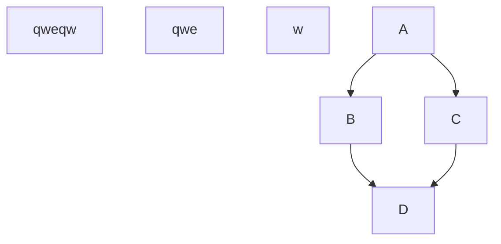
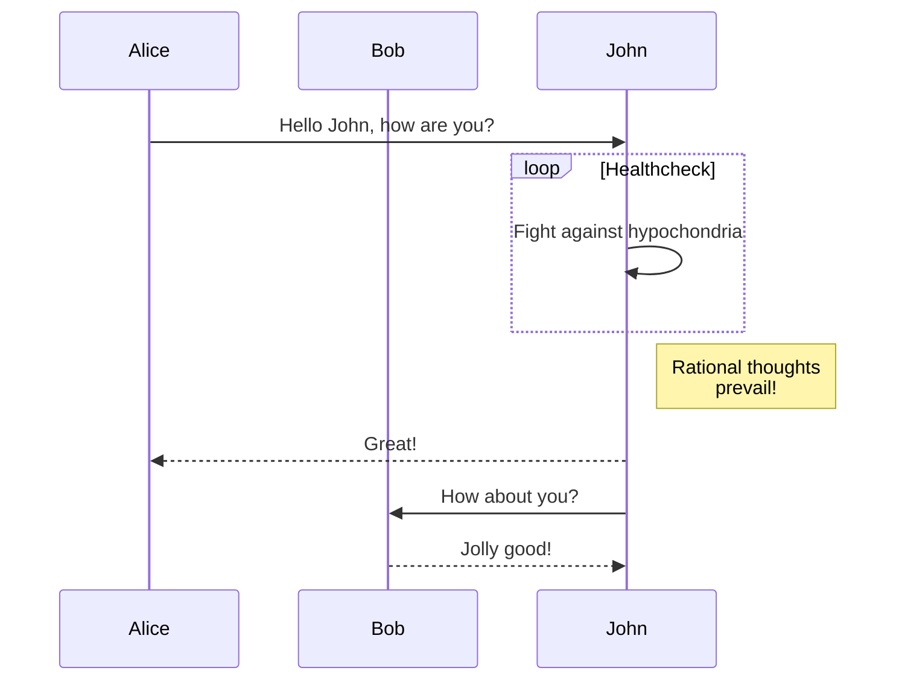
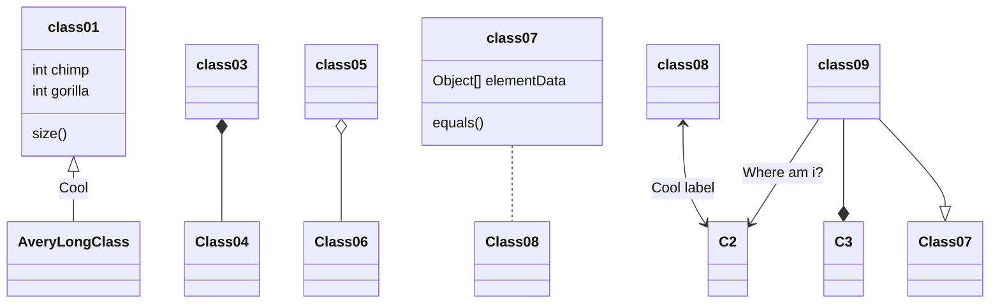
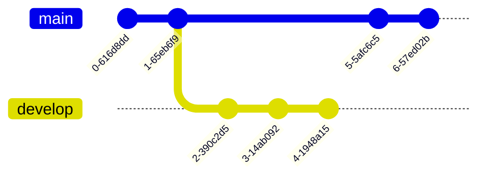

# Header 1
## Header 2qwewew
### Header 3
#### Header 4
##### Header 5
###### Header 6
*asterisks* 
_underscores_
**asterisks**
__underscores__
~~Strikethrough~~
[Homepage](https://www.tn-data.se)

```
function test() {
  console.log("notice the blank line before this function?");
}
```
 

# Sample Mermaid diagrams, for more details:
https://docs.github.com/en/get-started/writing-on-github/working-with-advanced-formatting/creating-diagrams

qweqewq





	
	
	





